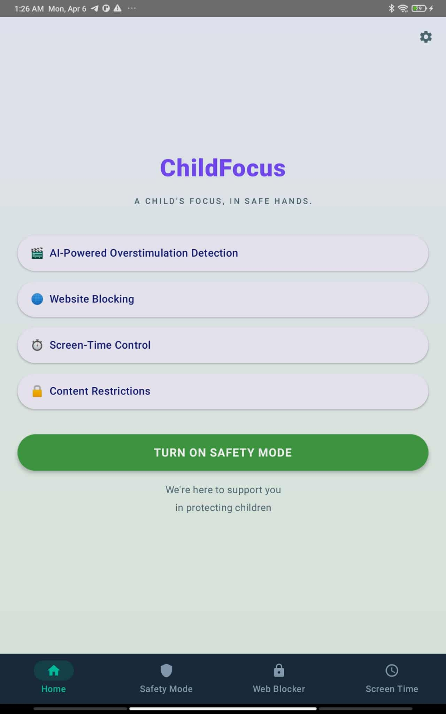
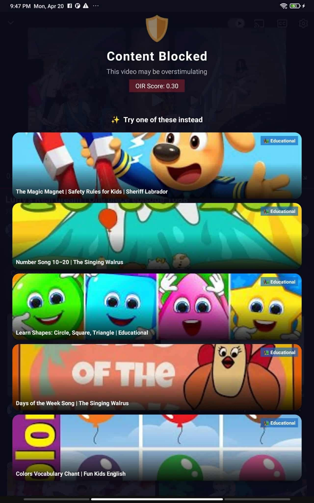
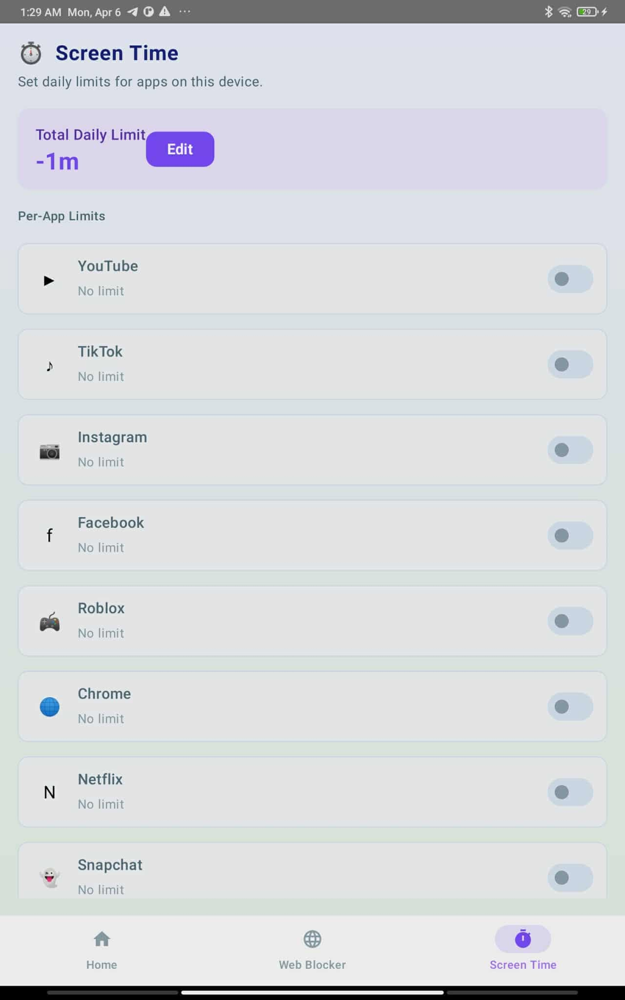
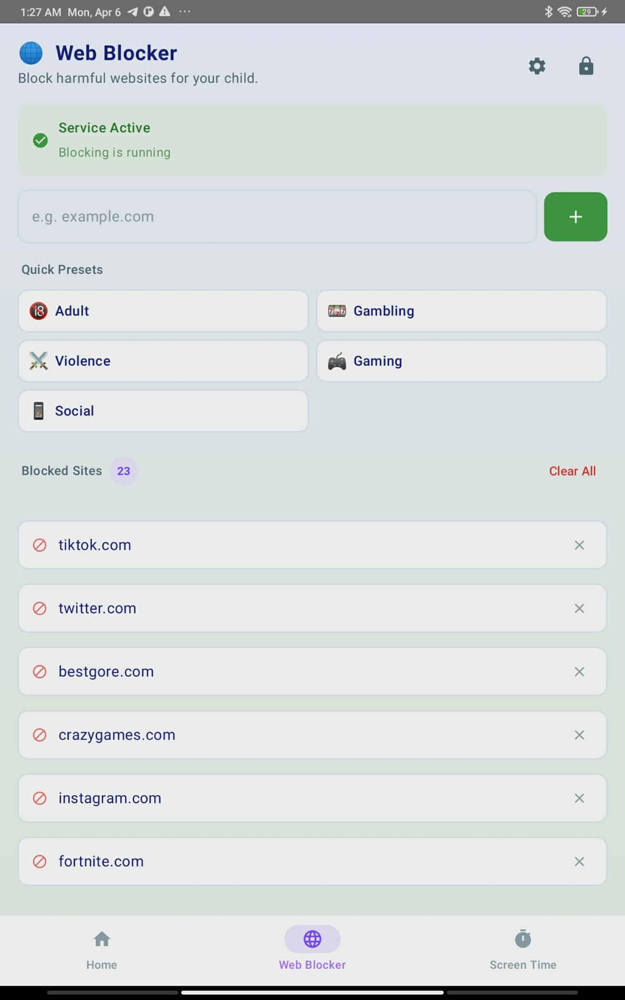

# ChildFocus

AI-based content filtering system for children's video content. ChildFocus scores YouTube
videos as **Educational**, **Neutral**, or **Overstimulating** using a hybrid of heuristic
video analysis (frame-change rate, color-saturation variance, audio tempo transitions) and a
Naive Bayes metadata classifier, then lets parents block, blur, or get alerted on flagged
content from an Android app.

## Features

- **Fast metadata classification** — a Naive Bayes model scores a video from its title,
  description, and tags in ~1-2 seconds, before any video is downloaded.
- **Full hybrid analysis** — for uncertain cases, the backend downloads the video and runs a
  3-segment heuristic pass (frame-change rate, color-saturation variance, audio tempo
  transitions) fused with the NB score for a final Educational / Neutral / Overstimulating
  label.
- **Result screen** — shows the video's score and label to the parent, color-coded against
  the same thresholds the backend used to decide (red/amber/green).
- **Safety Mode** — a lock-in mode that restricts the child's device to approved content
  until a parent unlocks it.
- **Screen time controls** — per-app time limits with usage tracking, so parents can cap how
  long specific apps are used.
- **Web blocker** — an accessibility-service-based blocker that can restrict access to
  specific sites/keywords in the device browser.
- **Settings** — parent-configurable block threshold, alert email, and screen-time limit
  (stored per-user as `parent_settings` JSON).
- **Firebase-authenticated parent accounts** — no passwords stored in this codebase; see
  [Authentication](#authentication) below.

## Screenshots

_Add screenshots of the app here — drop image files into the `docs/` folder using the
filenames below (or update the paths to match your own filenames):_

| Landing Page | Result | Safety Mode | Screen Time | Web Blocker |
|---|---|---|---|---|
|  |  |   |  |

Suggested screens to capture, based on `android/app/src/main/java/com/childfocus/ui/`:
`LandingScreen`, `ResultScreen`, `SafetyModeScreen`, `ScreenTimeScreen`, `WebBlockerScreen`,
`SettingsScreen`.

## Project structure

```
android/       Kotlin Android app (parent dashboard, video filtering UI)
backend/       Flask API (classification endpoints, YouTube metadata fetch)
database/      SQLite/Postgres schema + migrations
ml_training/   Notebooks and scripts used to train the Naive Bayes + heuristic models
docs/          API reference and sprint log
```

## Requirements

- Python 3.13
- Node.js v24
- ffmpeg >= 8.0.1
- Android Studio (for the `android/` app)

## Backend setup

```bash
cd backend
pip install -r requirements.txt
cp .env.example .env   # fill in your own values, see below
python run.py
```

The API runs at `http://localhost:5000` by default. See `docs/API.md` for the full
endpoint reference (`/health`, `/metadata`, `/classify_fast`, `/classify_full`, ...).

### Environment variables

None of these are committed to the repo -- copy `.env.example` to `.env` and fill in your
own values:

| Variable | Purpose | Notes |
|---|---|---|
| `SECRET_KEY` | Flask session signing key | Set a random value in production |
| `YOUTUBE_API_KEY` | YouTube Data API key | Get one from the Google Cloud Console |
| `DATABASE_URL` | DB connection string | Defaults to local `sqlite:///childfocus.db` |

## Authentication

ChildFocus does **not** store user passwords anywhere in this codebase -- there is no
password column in the `users` table (see `database/schema.sql`). Parent accounts are
authenticated via **Firebase Authentication** on the Android side
(`android/app/google-services.json`, which is intentionally left out of version control).
The backend only ever sees a `user_id` plus that user's filtering preferences
(`parent_settings` JSON -- block threshold, alert email, screen-time limit).

To run the Android app locally, add your own `google-services.json` from your Firebase
project console under `android/app/`.

## Android setup

```bash
cd android
./gradlew build
```

Open the project in Android Studio for the full IDE experience (emulator, layout preview, etc).

## Database

```bash
sqlite3 childfocus.db < database/schema.sql
```

Migrations live in `database/migrations/`.

## ML training

Notebooks and scripts for the heuristic scoring model and Naive Bayes metadata classifier
are in `ml_training/`. See `ml_training/notebooks` for the exploratory work and
`ml_training/scripts` for the production training pipeline.
